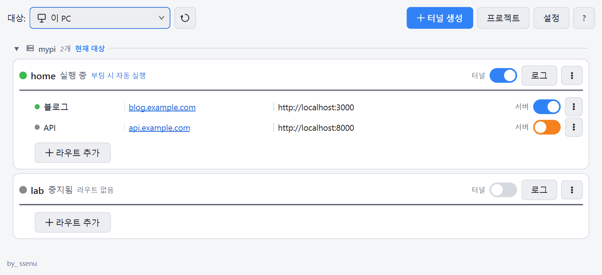
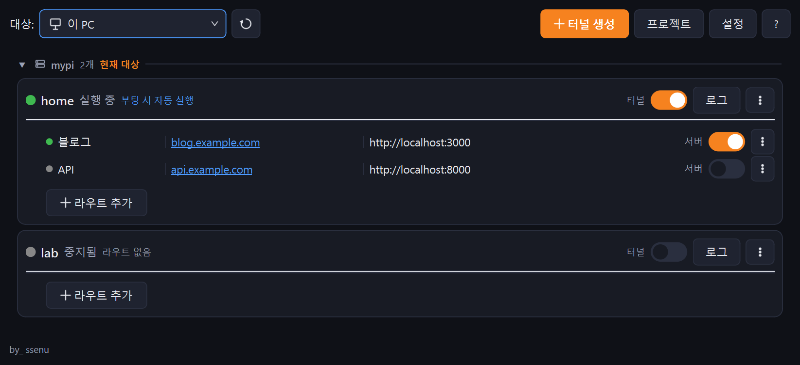
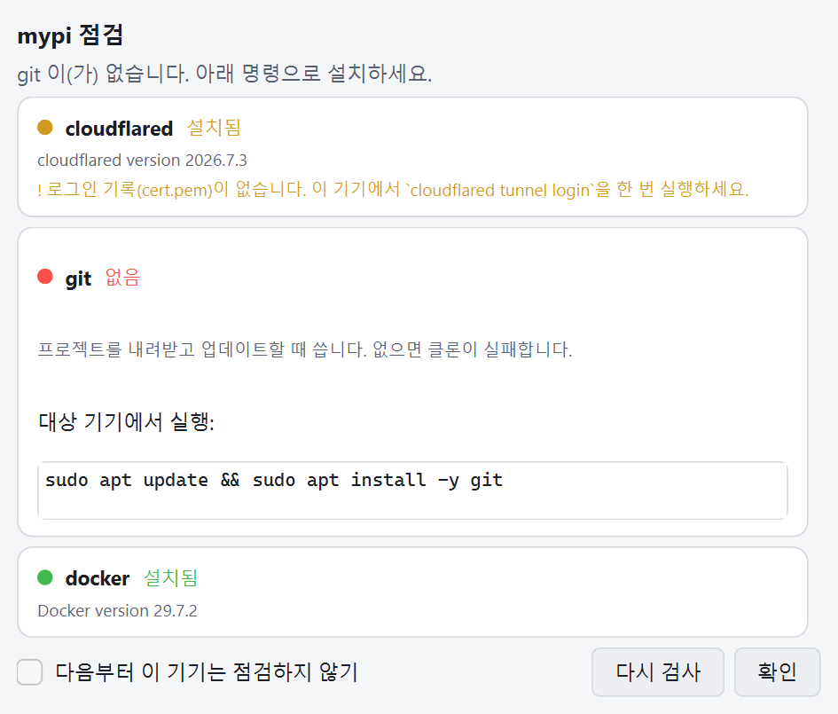
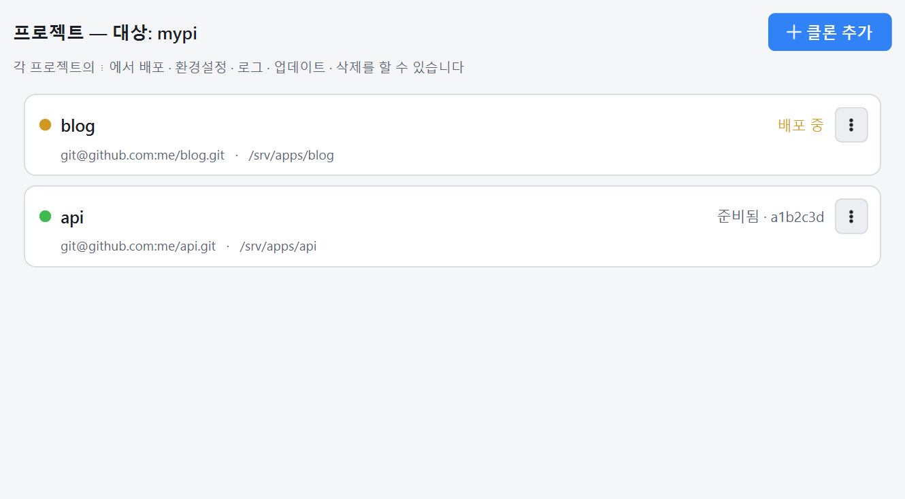

# Cloudflare Tunnel GUI

**집에 있는 컴퓨터나 라즈베리파이를, 내 도메인으로 서비스되는 서버로 만들어 주는 윈도우 앱.**

공유기 포트 포워딩도, 공인 IP도, DDNS도 필요 없습니다. 터널을 만들고 도메인을 붙이고
서버를 켜는 일을 전부 창 하나에서 합니다.



<details>
<summary>다크 모드</summary>



</details>

---

## 무엇을 대신해 주나

Cloudflare Tunnel로 사이트 하나를 여는 데 원래 필요한 일은 이렇습니다.

```bash
cloudflared tunnel login
cloudflared tunnel create mysite
cloudflared tunnel route dns mysite blog.example.com
nano ~/.cloudflared/config-mysite.yml      # ingress 규칙을 직접 작성
cloudflared tunnel run mysite &            # 터미널을 닫아도 죽지 않게 처리
ssh pi@... "cd /srv/apps/blog && git pull && docker compose up -d"
```

이 앱은 같은 일을 **터널 생성 → 도메인 입력 → 토글 켜기**로 끝냅니다. 라즈베리파이에
올릴 때도 SSH로 접속해 명령을 치는 대신, 대상만 바꾸면 똑같은 화면에서 다룹니다.

## 이런 분께

- 집 컴퓨터나 라즈베리파이로 **개인 사이트·API를 운영**하고 싶은 분
- 공유기 설정이나 방화벽을 건드리고 싶지 않은 분
- Railway·Vercel 같은 배포 경험을 **내 장비에서** 원하는 분
- `cloudflared` 명령을 매번 찾아보기 번거로운 분

**이런 건 못 합니다** — 도메인을 대신 사 주거나 Cloudflare 계정을 만들어 주지는 않습니다.
그 두 가지와 [필요한 프로그램](#1-필요한-프로그램) 설치는 직접 하셔야 합니다.

---

## 할 수 있는 일

| | 기능 |
|---|---|
| **터널** | 생성 마법사(터널 → DNS → 설정 파일 자동), 도메인 없이 터널만 먼저 만들기, 실패 시 되돌리기, DNS 레코드 충돌 시 덮어쓰기 |
| **도메인(라우트)** | 터널 하나에 서브도메인 여러 개, 각각 다른 로컬 포트로 연결, 도메인 클릭 시 브라우저로 열기 |
| **서버** | 실행 명령 또는 도커 컴포즈로 등록해 토글로 켜고 끄기, 터널과 함께 시작 |
| **배포** | `git pull` + 서버 재시작을 한 번에. 받아오기가 실패하면 재시작하지 않음 |
| **원격(SSH)** | 라즈베리파이 등 다른 기기를 같은 화면에서 관리, 기기별로 목록 분리 |
| **프로젝트** | Git 저장소를 대상 기기에 클론하고 목록으로 관리, `.env` 편집·업로드 |
| **부팅 자동 실행** | 대상 기기가 재부팅돼도 systemd가 터널을 다시 띄움 |
| **진단** | 준비물 점검(cloudflared·git·docker), 접속 확인(404/502 원인 판정), 포트 불일치 경고 |
| **로그** | 터널·서버 로그 실시간, 도커는 빌드 로그와 컨테이너 로그를 따로 |
| **그 외** | 라이트/다크 테마, 창 크기 기억, 삭제 전 확인, `?` 사용 안내 |

**앱을 꺼도 서버는 계속 돌아갑니다.** 이 앱은 프로세스를 소유하지 않습니다. 터널과 서버는
대상 기기에서 독립적으로 실행되고, 앱은 상태를 읽어 보여줄 뿐입니다. 창을 닫아도, 앱을
재시작해도, SSH가 끊겼다 붙어도 실행 중이던 것은 그대로 살아 있습니다.

---

## 시작하기

### 1. 필요한 프로그램

| | 어디에 | 왜 |
|---|---|---|
| **cloudflared** | 내 PC와 원격 기기 양쪽 | 터널을 만들고 실행합니다. 터널을 만든 기기에서만 그 터널을 켤 수 있습니다 |
| **git** | 원격 기기 | '프로젝트' 기능이 대상 기기에서 실행합니다 |
| **docker** | 원격 기기 | 서버를 도커 컴포즈로 띄울 때만 |

```bash
# 윈도우
winget install --id Cloudflare.cloudflared

# 라즈베리파이 OS / 우분투 (arm64)
curl -L -o cloudflared.deb https://github.com/cloudflare/cloudflared/releases/latest/download/cloudflared-linux-arm64.deb
sudo dpkg -i cloudflared.deb
sudo apt install -y git
curl -fsSL https://get.docker.com | sudo sh
```

> 원격 기기는 SSH로 접속할 때마다 앱이 자동으로 점검해서, 빠진 것이 있으면 설치 명령까지
> 보여줍니다. 셋 다 정상이면 "다음부터 보지 않기"를 켤 수 있습니다.



### 2. 도메인과 Cloudflare 계정

도메인을 하나 사고, Cloudflare에 사이트로 추가한 뒤 네임서버를 Cloudflare 것으로 바꿉니다.
상태가 **Active**가 되어야 터널을 연결할 수 있습니다.

### 3. 로그인

```bash
cloudflared tunnel login
```

브라우저에서 도메인을 고르면 `~/.cloudflared/cert.pem`이 만들어집니다. **터널을 만들 기기마다**
한 번씩 필요합니다(파이에서 운영할 거면 파이에서도).

### 4. 앱 실행

`dist\Cloudflare Tunnel GUI.exe` 를 실행하면 끝입니다. 파이썬 설치가 필요 없습니다.

소스로 돌리려면:

```bash
pip install -r requirements.txt
python -m app.main
```

---

## 화면 보는 법

```
┌──────────────────────────────────────────────────────────────┐
│ 대상: [🖥 이 PC ▾] [↻]        [＋터널 생성] [프로젝트] [설정] [?] │
├──────────────────────────────────────────────────────────────┤
│ ▼ 🖧 mypi  2개  현재 대상 ─────────────────────────────────── │ ← 기기 카테고리
│  ┌────────────────────────────────────────────────────────┐  │
│  │ ● home  실행 중  부팅 시 자동 실행    터널[ON] [로그] [⋮] │  │ ← 터널 카드
│  │ ─────────────────────────────────────────────────────  │  │
│  │  ● 블로그 │ blog.example.com │ :3000    서버[ON]   [⋮] │  │ ← 라우트(도메인)
│  │  ● API   │ api.example.com  │ :8000    서버[  ]    [⋮] │  │
│  │  ＋라우트 추가                                          │  │
│  └────────────────────────────────────────────────────────┘  │
└──────────────────────────────────────────────────────────────┘
```

- **대상** — 지금 다루는 기기. `이 PC` 또는 SSH로 연결한 원격 기기
- **기기 카테고리** — 터널은 *만든 기기*별로 묶입니다. 지금 대상이 아닌 그룹은 접혀 있고,
  머리글을 누르면 펴집니다
- **상태 색** — 회색=중지, 초록=실행 중, 빨강=오류
- **토글이 주황색** = 켜지는/꺼지는 중
- **도메인을 클릭** = 그 주소가 브라우저에서 열립니다

---

## 사용법

### 사이트 하나 올리기

1. **＋터널 생성** → 터널 이름 입력(목록에서 구분할 이름이라 접속 주소와는 무관)
2. 서브도메인 + 루트 도메인 → CNAME이 자동으로 만들어집니다
   *나중에 붙이려면 "도메인을 연결하지 않고 터널만 만들기"를 고르세요*
3. 로컬 서비스 주소 — 서버가 실제로 듣는 주소(`http://localhost:8000`)
4. (선택) 서버 실행 방법 — 명령 또는 도커 컴포즈
5. 서버 토글 → 터널 토글 순으로 켜기
6. 라우트의 도메인을 눌러 확인

### 터널 카드 `⋮`

| 항목 | 설명 |
|---|---|
| 터널 재시작 | 라우트를 바꾼 뒤 적용. 필요할 때는 카드에 **재시작** 버튼도 나타납니다 |
| 부팅 시 자동 실행 | 기기가 재부팅돼도 systemd가 다시 띄웁니다(SSH 대상 전용) |
| 터널 삭제 | 이름을 정확히 입력해야 실행됩니다 |

### 라우트 `⋮`

| 항목 | 설명 |
|---|---|
| 배포 | `git pull` 후 이 서버만 재시작. pull이 실패하면 재시작하지 않습니다 |
| 접속 확인 | 실제로 그 주소를 열어 보고 `200/404/502`와 다음에 할 일을 알려줍니다 |
| 편집 / 삭제 | 도메인·서비스 주소·실행 명령 변경 |

### 로그

카드의 **로그** 버튼 → 터널 로그와 서버 로그가 탭으로 열립니다.
**도커 서버는 탭이 둘**입니다.

- `(빌드)` — `docker compose up`의 빌드·기동 출력. 빌드가 깨졌을 때 볼 곳
- `(앱)` — 컨테이너 안 애플리케이션 로그. 500 오류가 났을 때 볼 곳

---

## 원격 기기 관리 (SSH)

상단 **대상 → SSH 대상 추가...**

| 항목 | 예시 |
|---|---|
| 이름 | `mypi` (목록에서 구분할 이름) |
| 호스트 | `100.x.x.x` 또는 `mypi` — Tailscale 주소나 LAN IP |
| 사용자 | `admin` |
| 키 파일 | `C:\Users\사용자\.ssh\id_ed25519` |

**키 인증만 지원합니다**(비밀번호는 저장하지 않습니다). 미리 공개키를 대상 기기의
`~/.ssh/authorized_keys`에 넣어 두세요. 집 밖에서도 접속하려면
[Tailscale](https://tailscale.com) 같은 메시 VPN을 권합니다 — 공유기 설정 없이 어디서나
같은 주소로 붙습니다. 라즈베리파이 전체 구축 절차는
[`docs/rpi-selfhost-setup.md`](docs/rpi-selfhost-setup.md)에 있습니다.

대상을 바꾸면 터널·서버·프로젝트·로그가 모두 그 기기 것으로 바뀝니다. 이전 대상에서
돌던 것은 **계속 실행된 채** 화면에서만 사라집니다.

## 프로젝트 (Git 클론)



SSH 대상에서만 쓰는 기능입니다. **프로젝트** 버튼 → **클론 추가** → Git 주소를 넣으면
대상 기기에 내려받습니다. 비공개 저장소는 `git@github.com:이름/저장소.git` 형식과
대상 기기에 등록한 키가 필요합니다.

각 카드의 `⋮`에서 **배포 · 환경설정 · 로그 · 업데이트 · 삭제**를 할 수 있고, 클론이나
배포가 도는 동안에는 동그라미와 상태 문구가 주황색이 됩니다.

### 환경설정 (.env)

`⋮ → 환경설정`은 프로젝트 폴더의 `.env`를 편집합니다. 비밀번호류(`*_PASSWORD`,
`*_SECRET`, `*_TOKEN`)는 가려서 보여주고, 내 PC에 있던 `.env`를 **파일에서 불러오기**로
올릴 수도 있습니다.

여러 프로젝트를 올릴 때는 **호스트 포트**를 다르게 주세요. compose에 이렇게 적어 두면
`.env`만 바꾸면 됩니다.

```yaml
ports:
  - "127.0.0.1:${HOST_PORT:-8000}:8000"
```

**compose 파일 자체는 앱이 건드리지 않습니다** — YAML을 다시 쓰면 주석이 사라지고,
대상 기기에 로컬 수정이 남아 다음 `git pull`이 막히기 때문입니다.

---

## 자주 겪는 문제

**`code: 1003` — DNS 레코드가 이미 있습니다**
그 주소에 이미 레코드가 있습니다(예전에 지운 터널이 남긴 CNAME인 경우가 흔합니다).
마법사가 띄우는 **기존 DNS 레코드 덮어쓰기**를 누르세요.

**404가 뜹니다**
그 주소가 터널 설정(ingress)에 없다는 뜻입니다. 라우트를 추가했는데도 404라면 실행 중인
cloudflared가 옛 설정을 들고 있는 것이니 **터널을 껐다 켜세요**(카드의 재시작 버튼).

**502가 뜹니다**
라우트는 맞는데 그 포트에 서버가 없습니다. 도커라면 compose가 여는 호스트 포트와
라우트의 로컬 서비스 주소가 같은지 확인하세요(앱이 저장할 때 경고해 줍니다).

**"이 대상에서 실행 불가"**
그 터널의 자격증명(`~/.cloudflared/<터널ID>.json`)이 이 기기에 없습니다. 만든 기기에서
켜거나 그 파일을 복사하세요.

**클론이 권한 오류로 실패합니다**
```bash
sudo mkdir -p /srv/apps && sudo chown $USER /srv/apps
```

**재부팅했더니 사이트가 죽어 있습니다**
도커 컨테이너는 살아나도 터널은 아무도 켜 주지 않습니다. 터널 카드 `⋮ → 부팅 시 자동 실행`을
켜 두세요.

---

## 알아두기

- 포트 포워딩·방화벽 개방이 필요 없습니다. cloudflared가 **바깥으로 나가는 연결만** 만듭니다
- HTTPS는 Cloudflare가 처리합니다. 로컬 서버는 http로 두어도 됩니다
- 웹서버는 `127.0.0.1`에만 바인딩하세요(도커라면 `"127.0.0.1:8000:8000"`)
- **터널을 켜는 순간 주소를 아는 누구나 접속할 수 있습니다.** 개인용이라면 Cloudflare Access로
  제한을 거세요
- SSH 비밀번호는 어디에도 저장하지 않습니다(키 인증만 사용)

### 데이터가 저장되는 곳

| 무엇 | 어디 |
|---|---|
| 앱 설정(터널·라우트·SSH 프로필·프로젝트) | `%APPDATA%\CloudflareTunnelGUI\settings.json` |
| 실행 상태(PID)와 로그 | **대상 기기**의 `~/.cloudflare-gui/run/` |
| cloudflared 설정·자격증명 | **대상 기기**의 `~/.cloudflared/` |

실행 상태를 대상 기기의 디스크에 두기 때문에, 앱을 지웠다 다시 깔아도 돌던 프로세스를
다시 찾아냅니다.

### 단축키

| 키 | 동작 |
|---|---|
| `F5` | 터널 목록 새로고침 |

---

## 개발자용

### 구조

```
app/
  core/      # PyQt 의존이 없는 순수 로직 (터미널에서 테스트 가능)
    runner.py        # LocalRunner / SshRunner 공통 인터페이스
    process_mgr.py   # 실행 상태 머신 (PID 파일 기반)
    cloudflared.py   # cloudflared CLI 래퍼
    config_yml.py    # config-*.yml 읽기/쓰기
    git_repo.py      # 클론·배포 명령과 상태 판정
    env_file.py      # .env 편집(주석 보존)
    autostart.py     # systemd 사용자 유닛
    prereq.py        # 준비물 점검
    sitecheck.py     # 공개 주소 진단
    store.py         # settings.json 데이터 모델
  ui/        # PyQt6 위젯
```

지키는 규칙 두 가지:

1. **`app/core/*`는 PyQt6를 import 하지 않습니다.** UI 없이 테스트할 수 있어야 하기 때문입니다
2. **모든 원격/로컬 동작은 `CommandRunner`를 통과합니다.** 새 기능도 `run()`,
   `spawn_detached()`, 파일 API만 쓰면 SSH에서 자동으로 동작합니다

느린 원격 조회(상태 폴링, 로그 읽기)는 워커 스레드에서 돌고 결과만 GUI로 돌려줍니다 —
창이 멈추지 않게 하기 위해서입니다.

### 테스트

```bash
pytest
```

### 빌드

```bash
pip install pyinstaller
pyinstaller --noconfirm "Cloudflare Tunnel GUI.spec"
```

결과물은 `dist\Cloudflare Tunnel GUI.exe`(단일 파일, 콘솔 없음)입니다.

### 문서

| 문서 | 내용 |
|---|---|
| [`docs/rpi-selfhost-setup.md`](docs/rpi-selfhost-setup.md) | 라즈베리파이 셀프호스팅 전체 절차 |
| [`docs/manual-test-checklist.md`](docs/manual-test-checklist.md) | 릴리스 전 수동 확인 목록 |
| [`docs/future-extensions.md`](docs/future-extensions.md) | 확장 아이디어 |

---

<sub>by_ ssenu</sub>
